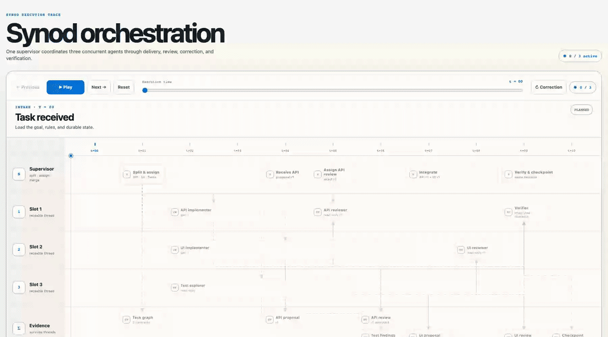

# Synod

Synod installs a persistent, reviewed advisor loop for Codex projects. The selected model profile assigns supervision, atomic implementation, exploration, review, verification, and mechanical work while keeping the primary agent responsible for integration and final evidence.

## Interactive cycle map

[](https://htmlpreview.github.io/?https://github.com/ivand890/synod/blob/main/docs/synod/synod-cycle.html)

[Open the interactive trace](https://htmlpreview.github.io/?https://github.com/ivand890/synod/blob/main/docs/synod/synod-cycle.html).

## Install

The default and supported bootstrap path is `pnpm dlx`:

```bash
pnpm dlx @ivand890/synod init
```

This installs the exact Synod version selected by `pnpm dlx` into `.synod/runtime` in the project. Each project therefore keeps an independent runtime and can upgrade on its own schedule. The project-local installation deliberately does not add a bare `synod` command to the repository's `PATH`; generated project instructions use the version-pinned `pnpm dlx @ivand890/synod@<version>` bootstrap, which restores and delegates to the local runtime. A global installation remains optional:

```bash
pnpm add --global @ivand890/synod
```

When a global or `pnpm dlx` entry point runs inside an initialized project, it delegates to that project's pinned local runtime. `pnpm` is the only bootstrap package manager exercised and supported for this initial implementation.

The local `node_modules/` directory is a disposable cache. After cloning a project, invoking Synod through `pnpm dlx` or an optional global installation reconstructs the exact version in `.synod/runtime.json` before delegating.

## Initialize a project

```bash
cd your-project
pnpm dlx @ivand890/synod init
```

Fresh installs default to the conservative `portable` profile. Run `pnpm dlx @ivand890/synod doctor` (or `synod doctor` with the optional global installation) before opting into `synod-5.6` so the exact model and reasoning capabilities are verified for the installed Codex runtime and account.

The examples below use the shorter `synod` form, which requires the optional global installation. Without it, prefix each command with `pnpm dlx @ivand890/synod`, for example `pnpm dlx @ivand890/synod doctor`.

Select a model profile, preview changes first, or replace conflicting Synod-managed files:

```bash
synod init --profile synod-5.6
synod init --profile portable
synod init --dry-run
synod init --force
```

Synod preserves an existing user-owned `.codex/config.toml`. It reports the file so you can merge the recommended model and agent defaults deliberately. It also never overwrites the user-owned goal, plan, state notes, decisions, or worklog under `docs/synod/`, even with `--force`; only the generated `STATUS.md` record is updated by orchestration commands. When an upgrade finds operational guidance in `DECISIONS.md`, `PLAN.md`, or `STATE.md` that differs from the current templates, it emits `SYNOD_DURABLE_STATE_PRESERVED`. Review the current managed instructions in `AGENTS.md` and `.agents/skills/synod-advisor/SKILL.md`, then update the preserved file manually if its Synod examples are stale.

If `AGENTS.md` contains multiple complete Synod managed blocks, initialization stops without writing. `synod init --force` consolidates those blocks into one canonical block and preserves surrounding user content. Incomplete, nested, or orphaned Synod markers are always rejected because their ownership boundary cannot be repaired safely.

Synod keeps canonical orchestration state in `.synod/state.json`, an append-only audit stream in `.synod/events.jsonl`, exact lease baselines in `.synod/lease-baselines.json`, the normalized acknowledged checkout snapshot in `.synod/checkpoint.json`, task-worktree history in `.synod/task-worktrees.json`, sealed proposals under `.synod/proposals/` and `.synod/worktree-proposals/`, and a generated human view in `docs/synod/STATUS.md`. Goal, decision, plan, state-note, and worklog Markdown remain user-owned supporting context. Upgrades and uninstall preserve these durable records.

The bootstrap records `.synod/runtime.json` schema 1 and creates an isolated pnpm project under `.synod/runtime/`. Its `package.json` and `pnpm-lock.yaml` pin the runtime, while its `.gitignore` excludes only `node_modules/`. Runtime metadata is deliberately separate from `.synod/manifest.json`: `runtimeVersion` identifies the executable, `templateVersion` identifies installed project content, and each descriptor keeps its own `schemaVersion`.

## Safe project lifecycle

Every installation records `.synod/manifest.json` schema 3 with the template version, selected profile, ownership, and a normalized SHA-256 hash for each managed path. Synod owns its generated infrastructure, shares ownership of only the marked block in `AGENTS.md`, and classifies canonical state, its event log, and the generated status view as mutable durable records that are preserved on uninstall.

Verify project integrity and runtime capabilities:

```bash
synod check
synod doctor
synod check --json
synod doctor --json
```

Preview and apply a template migration or profile change with the pinned runtime:

```bash
synod upgrade --dry-run
synod upgrade
synod upgrade --profile portable --dry-run
synod upgrade --profile portable
```

To upgrade the project runtime, select the desired bootstrap version explicitly. The dry run reports the runtime and template plan without installing or replacing the project-local runtime or changing project files; the apply replaces the local runtime atomically before running the template migration:

```bash
pnpm dlx @ivand890/synod@<version> upgrade --dry-run
pnpm dlx @ivand890/synod@<version> upgrade
```

Synod rejects attempts to replace a newer project runtime with an older one. A failed staged install leaves the previously pinned runtime and descriptor intact.

Initialization, upgrade, and uninstall recheck every destination immediately before mutation, replace files atomically, and roll back already-applied operations when a later operation fails. Modified Synod-owned files are conflicts; `--force` is required to replace or remove them. User-owned files are preserved even under `--force`.

Uninstall the managed infrastructure and project-local runtime while retaining `docs/synod/`, canonical orchestration, lease, proposal, and task-worktree records, and surrounding user content in `AGENTS.md`:

```bash
synod uninstall --dry-run
synod uninstall
```

Schema 1 manifests from v0.3.0 through v0.3.2 migrate through explicit `1 → 2 → 3` migrations. Schema 2 v0.4 projects migrate through `2 → 3`. A v0.7 schema-1 orchestration state migrates explicitly to schema 2 before v0.8 lease, recovery, correction, and proposal events can be appended. Published legacy template hashes remain the baseline so drift is detected before upgrade, and older CLIs reject a v0.8 project as an unsupported downgrade.

## Enforced orchestration

Create an atomic task with every field required before execution:

```bash
synod task add T-001 \
  --objective "Implement the API contract" \
  --executor synod_implementer \
  --acceptance "The documented success and failure cases pass" \
  --verification "pnpm test"
```

Acceptance criteria, verification commands, evidence, and dependencies are repeatable options. Use `--depends-on T-000` for prerequisites and `--cwd <directory>` outside the project root.

Task state follows a validated graph:

```text
PLANNED → READY → ACTIVE → REVIEW → ACCEPTED → VERIFIED → DONE
                         ↘ ACTIVE (correction)
```

Non-terminal tasks can be blocked or superseded. A blocked task can resume only its recorded prior state. Terminal tasks cannot transition.

Every transition requires an exact task revision. Submitting work from `ACTIVE` to `REVIEW` advances it by one and requires delivery evidence. Acceptance and verification each require separate evidence tied to that same revision. Returning reviewed, accepted, or verified work to `ACTIVE` increments the correction round and clears current acceptance and verification:

```bash
synod task transition T-001 READY --revision 0
synod task transition T-001 ACTIVE --revision 0
synod task transition T-001 REVIEW --revision 1 --evidence "commit:abc123"
synod task transition T-001 ACCEPTED --revision 1 --evidence "review:approved"
synod task transition T-001 VERIFIED --revision 1 --evidence "test:pnpm-test:pass"
synod task transition T-001 DONE --revision 1
```

Each evidence item also captures the Git branch, exact `HEAD`, and content-sensitive working-tree fingerprint observed for that event. State mutations hold an exclusive project lock, validate the complete event hash chain, append one event, and atomically replace state plus its Markdown projection.

### Writer leases and recovery

Every delegated writer uses a two-phase reservation so its scopes and immutable baseline are durable before Codex starts the child. Declare the narrowest allowed scopes; exact paths use `--write`/`--read`, while directory trees use `--write-tree`/`--read-tree`:

```bash
synod lease reserve T-001 \
  --write-tree src/api \
  --read-tree test/fixtures \
  --reservation-ttl-seconds 300 \
  --json
```

The reservation returns `writeAuthorized:false`, an opaque token, lease ID, generation, task revision, reservation timestamp, baseline hash, and expiry. Give the child a read-only initial contract: analysis may begin, but writes, worktrees, and implementation commands must wait for bind confirmation. After `spawn_agent` returns the owner thread, bind every returned fence value; bind atomically grants `writeAuthorized:true` and moves the task to `ACTIVE`:

```bash
synod lease bind T-001 \
  --reservation-token <token> --lease-id <id> --generation 1 --revision 0 \
  --expected-reserved-at <iso> --baseline-hash <sha256> \
  --owner-thread thread:019f... --ttl-seconds 300 --heartbeat-seconds 60 \
  --json
```

If spawn fails, run `lease cancel` with the complete reservation fence and a reason. If no owner ID returns, wait for the reservation TTL and use the reservation form of `lease expire`. Neither pre-bind cleanup path creates an abandoned-worker recovery record because the reservation never authorized writes. Synod cannot invoke Codex `spawn_agent`; an atomic `delegate start` is deferred until a typed integration can perform both halves of the handshake.

Callers that already know the worker identity may still use `lease acquire`. After bind or acquire, the JSON result contains the active lease ID, generation, task revision, owner, and `heartbeatAt`. Copy those exact values into heartbeat, release, worktree, revocation, or recovery commands; a stale value fails closed:

```bash
synod lease acquire T-001 --owner-thread thread:known \
  --write-tree src/api --ttl-seconds 300 --heartbeat-seconds 60 --json
```

```bash
synod lease heartbeat T-001 --lease-id <id> --generation 1 --revision 0 \
  --expected-heartbeat-at <iso> --owner-thread thread:019f...
synod lease release T-001 --lease-id <id> --generation 1 --revision 0 \
  --expected-heartbeat-at <new-iso> --owner-thread thread:019f...
```

Overlapping write scopes are rejected deterministically, including path/tree overlaps. Declared read scopes may coexist with readers and writers because they do not reserve mutation ownership. Synod compares the live scoped delta to the lease baseline before review so out-of-scope writes cannot be accepted silently.

If a worker stops, an authorized supervisor revokes or expires its lease and makes one explicit recovery decision. Revocation seals the ended generation's scoped proposal without accepting it:

```bash
synod lease revoke T-001 --lease-id <id> --generation 1 --revision 0 \
  --expected-heartbeat-at <iso> --reason "worker stopped"
synod lease recover T-001 --lease-id <id> --generation 1 --revision 0 \
  --expected-heartbeat-at <iso> --decision reassign \
  --owner-thread thread:replacement --reason "continue the preserved proposal"
```

`resume`, `reassign`, and `supersede` are distinct hash-chained decisions. Recovery never changes acceptance or verification, and the sealed proposal remains verifiable in `.synod/proposals/`.

### Bounded correction policy

Tasks carry their correction allowance in canonical state. Once it is exhausted, another ordinary return to `ACTIVE` is rejected. The supervisor must supersede the task, split the remaining work, or record a bounded approval:

```bash
synod task override T-001 --additional-rounds 1 --approver release-owner \
  --reference approval:123 --reason "one focused retry" --evidence review:exhausted
synod task split T-001 --replacement T-001A --replacement T-001B \
  --reason "separate the exhausted scope" --evidence review:split
```

Replacement tasks must already exist. Split supersedes the exhausted parent and records the relationship without accepting either replacement.

### Local token budgets

Task budgets are optional, use raw total tokens, and bind enforcement to one root session plus one exact canonical start event:

```bash
synod budget set T-001 --session thread:019f... --since-event 12 \
  --soft-tokens 100000 --hard-tokens 150000 \
  --reason "bound this implementation phase" --evidence roadmap:SYN-092A
synod budget report T-001
synod budget observe T-001
```

`budget report` is read-only. `budget observe` records the normalized report and its rollout provenance. A soft crossing warns; a recorded hard crossing requires one exact supervisor decision without changing task state, acceptance, verification, or lease ownership:

```bash
synod budget decide T-001 --observation <event-id> --decision continue \
  --additional-tokens 25000 --reason "finish the bounded correction" \
  --evidence review:budget
```

While that decision is pending, Synod rejects new leases, heartbeats, resume/reassignment, correction approval, and transitions to `READY` or `ACTIVE`. Delivery, review, acceptance, verification, revocation, status, handoff, split, and supersession remain available. `split`, `supersede`, and `rotate` decisions do not grant more execution; the corresponding structural action must complete. Rebinding a policy uses `synod budget replace` and preserves every prior policy, observation, decision, and raw total.

### Explicit phase rotation

Project-level rotation is opt-in. A policy binds the initial root session and canonical start event, then enables only the thresholds supplied by the caller:

```bash
synod rotation set --session thread:old-root --since-event 12 \
  --context-percent 80 --compactions 3 --wait-calls 5 \
  --wait-duration-ms 600000 --completed-tasks 2 \
  --reason "bound the supervision phase" --evidence roadmap:SYN-093A
synod rotation report
```

The report is read-only and lists every configured metric, its current value, threshold, availability/completeness, exact phase interval, and deterministic report hash. Supervisor context uses the latest root-thread context observation rather than cumulative input; missing context-window evidence is `unavailable` and cannot trigger. No threshold is enabled by default.

Rotation is a two-step canonical handshake. `prepare` records the recommendation, rollout-prefix provenance, checkpoint, and handoff identity without changing tasks, Git, or Codex threads. Start the next root session outside Synod, then verify its exact identity:

```bash
synod rotation prepare
synod rotation verify --recommendation <event-id> --session thread:new-root
```

Verification requires creation-time evidence that the selected root was started after `prepare`; it rejects the old or another pre-existing root, descendant IDs, another project directory, checkpoint drift, a stale handoff, a reused recommendation, or any intervening canonical event. The verification event becomes the next phase's exact start boundary. `status`, handoff text/JSON, upgrade, and uninstall preserve the full policy, recommendation, and verification history.

Task mutations do not move the canonical checkpoint, so they cannot silently accept repository drift. Only `synod checkpoint` changes the acknowledged branch, `HEAD`, and working-tree fingerprint.

Read actual state and compare its last checkpoint with the current repository:

```bash
synod status
synod status --explain
synod status --json
```

`status` exits non-zero with `SYNOD_CHECKPOINT_DRIFT` when branch, `HEAD`, or relevant working-tree content differs. `status --explain` adds a read-only path delta in text or JSON that distinguishes committed, staged, unstaged, untracked, deleted, renamed, resolved, and binary paths since the acknowledged checkpoint. Synod-owned infrastructure and orchestration records are excluded so Synod does not create its own drift. After investigating a deliberate change, accept it explicitly:

```bash
synod checkpoint --message "Accepted the integrated revision"
```

Do not hand-edit `.synod/state.json`, `.synod/events.jsonl`, `.synod/checkpoint.json`, `.synod/task-worktrees.json`, sealed proposal directories, or `docs/synod/STATUS.md`. A broken event sequence, hash chain, state/log match, lease baseline, checkpoint snapshot, proposal identity, task-worktree chain, or Markdown projection fails closed. Historical checkpoints created before snapshot support remain valid for summary status, but path-level explanation requires recording a new checkpoint when the historical worktree no longer matches the live checkout.

## Canonical handoff

Generate read-only continuation context directly from canonical task records and the live checkpoint delta:

```bash
synod handoff
synod handoff --bundle ../project-recovery.bundle
synod handoff --json
```

The handoff reports the acknowledged and current checkpoints, drift and path delta, focus tasks, blockers, lease/recovery/proposal state, incomplete dependencies, unresolved acceptance and verification gates, current-revision evidence, legal next transitions, and verified proposal/worktree artifact counts. It does not treat `GOAL.md`, `PLAN.md`, `STATE.md`, `WORKLOG.md`, or chat history as authoritative, and it does not update canonical records or `STATUS.md`. If pending orchestration recovery would require a write, or any durable proposal/worktree artifact does not verify, handoff fails closed instead. `status` and `check` enforce the same artifact validation.

An optional bundle must pass full verification and match the canonical checkpoint fingerprint and snapshot hash. A bundle exported earlier at that checkpoint remains valid after later task events; handoff labels its event identity as older instead of pretending it is current. A bundle from another checkpoint is rejected.

`DONE` means only that Synod's local delivery, acceptance, and verification transitions completed for the recorded task revision. It does not mean the work is committed, pushed, reviewed by a hosting provider, deployed, externally approved, or operationally verified; those outcomes require their own evidence.

## Optional isolated task worktrees

An active leased task can execute in an explicit detached Git worktree outside the control checkout. Creation binds the destination, control branch and `HEAD`, task revision, owner, generation, lease baseline, and allowed scopes:

```bash
synod worktree create T-001 --destination ../task-T-001 \
  --lease-id <id> --generation 1 --revision 0 \
  --expected-heartbeat-at <iso> --owner-thread thread:019f...
synod task transition T-001 ACTIVE --revision 0
```

After the worker stops editing, the supervisor seals its exact staged, unstaged, deleted, renamed, and allowed untracked delta into a durable proposal, then integrates it transactionally into the control checkout:

```bash
synod worktree status T-001
synod worktree seal T-001 --lease-id <id> --generation 1 --revision 0 \
  --expected-heartbeat-at <iso> --owner-thread thread:019f...
synod worktree integrate T-001 --lease-id <id> --generation 1 --revision 0 \
  --expected-heartbeat-at <iso> --owner-thread thread:019f...
synod task transition T-001 REVIEW --revision 1 --evidence worktree:integrated
```

Integration refuses a moved base, changed proposal, unowned or ambiguous control drift, and stale or expired fencing. It preserves independently attributed drift and verifies the installed fingerprint before marking the integration complete. Creation and integration intents are recoverable after interruption.

Cleanup is separate and non-force. It refuses any dirty or untracked material, never removes the control checkout or an unrelated registered worktree, and keeps the sealed proposal and registry history:

```bash
git -C ../task-T-001 status --short
synod worktree cleanup T-001
```

## Local recovery bundles

Export the exact acknowledged dirty checkpoint to a deterministic directory bundle outside the source checkout, then verify it without changing either checkout or bundle:

```bash
synod bundle export ../project-recovery.bundle
synod bundle export ../project-recovery.bundle --include-untracked
synod bundle verify ../project-recovery.bundle
synod bundle verify ../project-recovery.bundle --json
git clone <source> ../restored-project
synod bundle restore ../project-recovery.bundle --cwd ../restored-project
synod bundle restore ../project-recovery.bundle --cwd ../restored-project --json
```

Export requires an acknowledged Git `HEAD`; the live branch, `HEAD`, Git index, and relevant worktree fingerprint must still match that checkpoint. If acknowledged untracked files exist, `--include-untracked` is mandatory; otherwise export fails instead of creating an incomplete artifact. The command holds the orchestration lock while it reads canonical state and source material, verifies a temporary sibling bundle, rechecks the source, reserves a destination that did not already exist, and publishes `manifest.json` last as the atomic completion marker. It does not change canonical records, the worktree, index, commits, refs, or remotes.

A schema-1 bundle contains canonical `manifest.json` plus raw content-addressed objects under `objects/`. The manifest binds the bundle ID to source branch/`HEAD`, checkpoint and snapshot hashes, last event identity, path modes and types, object sizes and SHA-256 values, and whether untracked material was included. Its deterministic `createdAt` is the acknowledged snapshot capture time, so repeated exports of the same checkpoint with the same Synod version serialize identically. Bundles can contain source code, secrets, binary data, and symlink targets, so keep them local and protect them like the checkout itself.

Verification parses external JSON fail-closed, requires canonical serialization, rejects unknown fields and unsafe or colliding paths, and checks the exact object inventory, sizes, hashes, and symlink boundaries without writing. Dirty submodules and Git intent-to-add entries are deliberately unsupported by bundle schema 1; dirty submodules return `SYNOD_RECOVERY_SUBMODULE_UNSUPPORTED`, while intent-to-add material is rejected as an invalid or incomplete schema-1 bundle.

Restore requires a destination checkout at the bundle's exact base `HEAD` with no relevant staged, unstaged, or untracked changes. It derives the expected normalized checkpoint fingerprint before mutation, writes required content-addressed blobs without changing commits or refs, constructs a private temporary index, and journals the exact prior index bytes and every affected filesystem path inside the destination Git directory. It holds Git's standard `index.lock` across final index installation so another Git writer cannot be overwritten. The operation commits only after a fresh capture exactly matches the bundled fingerprint. Any ordinary failure restores the prior index and worktree; a killed process leaves the durable journal, and the next restore invocation safely rolls it back before retrying. If a journaled path, index, or index lock changed outside Synod, rollback fails closed with `SYNOD_RECOVERY_ROLLBACK_FAILED` and preserves the journal instead of overwriting concurrent content.

## Token usage and canonical intervals

Report the latest Codex session tree for the current project, including every delegated subagent. Synod compares active and archived root sessions and selects the one with the newest `updatedAt` value:

```bash
synod usage --by-model
```

Select a particular session using either its root thread id or any descendant thread id, or emit stable JSON for automation:

```bash
synod usage --session 019f... --by-model
synod usage --json
```

Measure marginal usage after one validated canonical boundary, optionally closing it at a second exact event:

```bash
synod usage --since-event 12
synod usage --since-event 12 --until-event 18
synod usage --since-event 019f-event-id --until-event 019f-event-id
synod usage --since-checkpoint
synod usage --task SYN-090A --session 019f...
```

The three start selectors are mutually exclusive. Event selectors accept one exact canonical sequence or ID. `--since-checkpoint` binds the report to the currently acknowledged checkpoint and the canonical event that introduced it. `--task` requires `--session <root-or-descendant-id>` because canonical tasks do not yet persist a root-session binding; it starts at the task's first canonical event and closes at its first `DONE` or `SUPERSEDED` event. A live task ends at local capture time. Whole-session reports without `--task` retain latest-root selection. Every interval uses `(start, end]`, so an observation at the start is excluded and one at the end is included. Canonical boundaries with indistinguishable timestamps are rejected instead of guessing sub-timestamp ordering.

Synod validates the complete state/event chain read-only, then reads Codex's local session metadata through the App Server and reconstructs deltas from the complete persisted counter stream before clipping observations to the interval. Counter decreases start a new epoch. Later model reroutes affect only later observations. A closed report excludes descendants created after its end and records the included byte length and SHA-256 rollout prefix for each thread. JSON reports `discoveredThreads` for every selected descendant and `contributingThreads` for rows with a non-zero token delta; the deprecated `total.threads` alias equals the latter. Zero-token rows remain for rollout provenance and coordination attribution. JSON also adds interval provenance, completeness, per-thread rows, per-role totals, the thread/model/role cross-product, and a separate `coordination` report while retaining the existing `models` and `total` fields.

Coordination is derived only from normalized tool-call records. `spawn_agent`, `followup_task`, `send_message`, `wait_agent`, `list_agents`, and `interrupt_agent` are reported separately from implementation tools, by thread and role. Calls and outputs pair by `call_id`; observed and requested wait durations are included when the rollout supplies them. Compaction pairs are de-duplicated. Tool-aware outcomes distinguish succeeded, normal wait no-change, real timeout, failure, and unknown without copying outputs; tool names are retained without arguments. Plain-text coordination validation errors count as failures, while structured `wait_agent` expiry is no-change. Missing outputs make the measurement incomplete. Duration, outcome, and retry metrics use explicit `available`, `partial`, or `unavailable` states instead of fabricating zero when Codex did not persist enough evidence.

For a closed exact interval, duration and outcome metrics include only call/output pairs fully contained in `(start,end]`. Calls crossing either boundary are excluded under `coordination.boundary.crossingCalls`; a post-end output contributes only byte-length/SHA-256 boundary evidence, never content or interval activity. A fully observed crossing does not make the report incomplete, but a crossing call whose output is still missing does. Because there is no persisted event-to-call causal identity yet, adjacent exact intervals are not guaranteed to sum to whole-session call counts.

Whole-session and live canonical reports are explicitly `incomplete` persisted snapshots. A closed exact interval is `complete` only when every required rollout and timestamp is readable and ordered. Missing rollout paths, malformed required counters, timestamp regressions, ambiguous selectors, conflicting thread identities, and insufficient descendant creation evidence fail closed for exact reports.

Usage reporting never writes canonical records, acknowledges a checkpoint, changes Git, or uploads telemetry. Normalized facts and reports do not retain prompts, messages, reasoning text, tool arguments, or tool outputs. Input includes cached input, and output includes reasoning output; the total therefore does not add those subsets twice. Token counts are usage evidence rather than billing data.

For an optional local estimate, pass a dated caller-owned price file to a complete closed usage report:

```bash
synod usage --since-event 12 --until-event 18 --price-file ./prices-2026-08.json
```

Price-file schema 1 contains `currency`, `asOf`, optional `validUntil`, a `source` reference, and an exact `models` map with `uncachedInputPerMillion`, `cachedInputPerMillion`, and `outputPerMillion`. Synod computes uncached input as input minus cached input and charges output once; reasoning remains visible as raw evidence because it is already included in output. Unknown models produce an explicit partial report with no grand total. Invalid currency/date/rates, stale validity, incomplete usage, or inconsistent inclusive counters fail closed. Without `--price-file`, text and JSON contain no monetary fields. Synod never fetches prices, converts currency, applies tax or credits, or contacts a billing provider.

This command requires a locally installed `codex` executable with App Server support. Startup performs a minimal `thread/list` capability probe. Cleanup sends `SIGTERM`, waits up to two seconds, uses a bounded `SIGKILL` fallback, and detaches unresponsive process handles when exit still cannot be confirmed.

For a session that is still running, the report is a persisted snapshot: the active request appears after Codex emits its next token counter update.

## Change-driven thread waiting

Wait for one or more child threads to become quiescent without a fixed busy-poll loop:

```bash
synod wait --thread thread:one --thread thread:two --timeout-seconds 300
synod wait --thread thread:one --poll-interval-ms 1000 --json
```

Synod prefers App Server status notifications, then a status cursor when available. If neither capability exists it uses a bounded polling fallback of at most five seconds. Text and JSON report `mode`, `wakeCount`, `fallbackPollCount`, elapsed time, timeout/abort state, and whether approval or user input is required. Every path bounds startup, waiting, listener removal, and client cleanup; cleanup degradation is emitted as a warning instead of leaving a process handle alive.

## JSON contract

Every command with `--json` emits exactly one JSON document. Envelope schema version 1 has this top-level shape:

```json
{
  "schemaVersion": 1,
  "ok": true,
  "command": "usage",
  "data": {},
  "warnings": [],
  "diagnostics": {
    "synodVersion": "0.9.0",
    "nodeVersion": "24.12.0",
    "platform": "darwin",
    "codexVersion": "0.142.0"
  }
}
```

Failures set `ok` to `false`, omit `data`, include `error: { code, message, details? }`, and return a non-zero exit status. Warnings use `{ code, message, details? }`. Codes are stable within schema version 1.

Lifecycle errors include stable codes for invalid/unsupported manifests, invalid or conflicting local runtimes, failed runtime installation or execution, required upgrades, conflicts, unsafe paths, destination races, transaction rollback, and unsupported downgrades. Orchestration errors identify invalid state/logs, state-log mismatch, held locks, invalid tasks or transitions, stale revisions, missing evidence, checkpoint drift, lease conflicts and fencing, proposal validation, correction exhaustion, wait failures, and worktree reconciliation. Recovery errors distinguish invalid or corrupted bundles, existing export destinations, required untracked opt-in, unsupported dirty submodules, wrong restore bases, dirty destinations, restore failures, invalid journals, and rollback failures. Existing command, App Server, session, and JSON codes remain stable within envelope schema version 1.

Warnings identify preserved user state, available upgrades, missing user-owned files, incompatible profiles, unsupported Codex versions, and bounded App Server cleanup fallbacks.

## Model profiles and Codex compatibility

List the built-in profiles:

```bash
synod profiles
synod profiles --json
```

- `synod-5.6` uses Sol for supervision, Luna for cost-efficient implementation/mechanical work, and Terra for exploration/review/verification. Its global subagent fallback is Terra because current Codex 0.147 validates that fallback against the narrower spawn override set before applying a selected custom-agent file; Luna remains valid inside the implementer and mechanical agent files. The profile requires Codex 0.147.0 or later within the supported range, including eligible previews such as `0.147.1-alpha.1`, and verifies the fallback plus each role model and reasoning effort through `model/list`.
- `portable` uses GPT-5.5 at role-specific reasoning efforts. It is the conservative fallback verified across both known-good Codex versions and account-specific model catalogs.

`synod doctor` identifies whether Synod is running from Codex CLI or Codex Desktop and probes that surface's own App Server executable. It resolves the active Codex process from the process ancestry, falling back to `codex` from `PATH` for a standalone CLI invocation. An explicit `SYNOD_CODEX_BIN` still takes precedence. If Desktop is detected but its executable cannot be resolved, `doctor` fails closed instead of silently reporting the CLI version as the Desktop version.

CLI and Desktop may share `~/.codex` while running different Codex versions. Inspect the `codex` object under `data` on success or `error.details` on failure—especially `surface`, `version`, `executable`, `executableSource`, and `home`—instead of assuming the two installations match.

It then classifies that surface's Codex version independently from model availability:

- Supported: `>=0.142.0 <0.148.0`.
- Known-good and exercised in CI: `0.142.0`, `0.147.0`.
- Supported but not known-good: stable or preview builds whose numeric base is inside the range. This version classification alone does not assert profile availability.
- Unsupported: versions below the range and versions at or above `0.148.0`, including previews of those versions, until the CI contract is deliberately expanded.

The numeric version range determines `codex.status` and version eligibility; only matrix-tested versions are `known-good`. Live App Server and model probes independently determine `modelCompatible` and profile compatibility. Overall health requires both an eligible version and the selected profile's required capabilities.

## Advisor routing

- The configured supervisor plans, decomposes, supervises, reviews, integrates, and verifies.
- The configured implementer completes atomic tasks with explicit write scope and acceptance criteria.
- Explorer, reviewer, verifier, and mechanical roles use the selected profile's declared models and reasoning efforts.
- Spawn a configured custom agent by its name with a fresh fork and a self-contained contract. Do not send explicit model or reasoning overrides: the custom agent file resolves first, followed by `[agents]` defaults and then the parent configuration. Full-history forks inherit the parent agent type.
- The spawn tool's explicit override list is not the complete custom-agent model catalog: a custom agent file can select Luna even when explicit per-call overrides list only Sol and Terra. The global `[agents].default_subagent_model` is different because current Codex validates it through that narrower spawn path before applying the custom-agent layer. Synod therefore keeps a Terra global fallback while role files retain their own models. `synod doctor` verifies the broader model capabilities; a controlled child `turn_context` is the final check when resolution is in doubt.

The supervisor does not perform routine implementation. It may make only a minimal integration repair when delegating that repair would cost more than the change, and must record the exception.

## Development

```bash
pnpm install --frozen-lockfile
pnpm typecheck
pnpm build
pnpm test
pnpm test:package
pnpm test:codex-compatibility # requires explicit SYNOD_EXPECTED_* environment values
pnpm pack --pack-destination dist
```

Source uses strict TypeScript 7 with explicit `.js` ESM specifiers and compiles into `dist`; published consumers execute JavaScript and do not need TypeScript. CI exercises the installed tarball on Node 20, 22, and 24 on Ubuntu, plus Node 24 on macOS and Windows.

Every change lands through a pull request with required CI. Protected `vX.Y.Z` tags publish both npm and GitHub releases, with exact-commit and `latest` parity enforced before the workflow succeeds; see [RELEASING.md](RELEASING.md).
